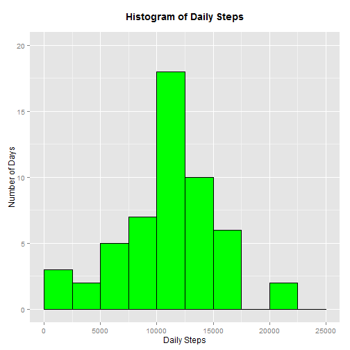
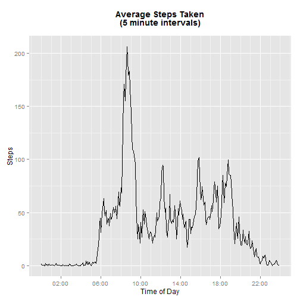
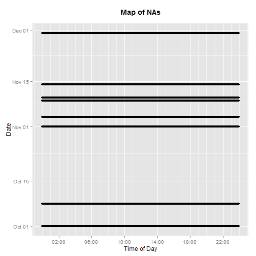
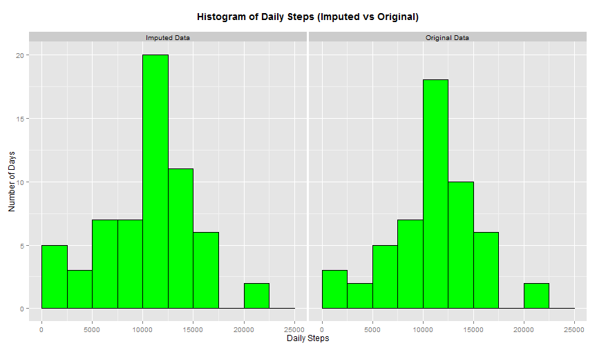
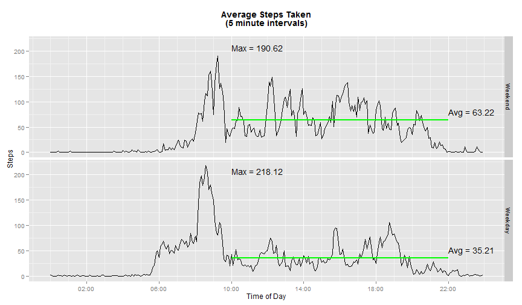

# Reproducible Research: Peer Assessment 1
_**Author:  Daddy the Runner**_  
_**Date:  Wednesday, January 14, 2015**_

<!-- Processing Instructions --------------------------------------- -->
<!--                                                                 -->
<!-- This file is best processed using the following set of commands -->
<!-- knit("PA1_template.Rmd")                                        -->
<!-- render("PA1_template.md")                                       -->
<!--                                                                 -->
<!-- --------------------------------------------------------------- -->

## Introduction and Explanations

This report was written using R markdown and processed using the `knitr`
and `markdown` packages.  The report is best viewed in the final HTML
format.  However, GitHub's default method of displaying HTML documents is
to show the raw HTML.  Therefore, for the purposes of this class
project, the intermediate markdown file is viewed using GitHub.
Unfortunately, the GitHub rendering of the markdown file ignores some of
the HTML code included in the R markdown file for formatting the final
HTLM report.  Therefore, the intermediate markdown file contains an
output header table that can't be suppressed and the style template is
printed at the top of the document.

The R markdown file was processed using the following commands:


```r
knit("PA1_template.Rmd")
render("PA1_template.md")
```

<!-- The following formatting section is ignored by GitHub but is    -->
<!-- used in the generation of an HTML report.                       -->

<!-- Create some style elements for the HTML file -->
<style>
h2 {
  color: green;
  margin-top: 5ex;
}

p {
  font-size: 12pt;
}

.fig-caption {
  font-size: 10pt;
}
</style>


## Loading and preprocessing the data

First, we load all required libraries. And initialize some variables.


```r
require(dplyr)
require(ggplot2)
require(scales)

## Create a figure counter
fig.num <- 0L

## Create a table counter
tbl.num <- 0L
```

The following code chunk will extract the data file from the
zip file if it doesn't exist in the local directory.


```r
data.fn <- "activity.csv"
zip.fn <- "activity.zip"
if (!file.exists(data.fn)) {
  # Extract the data from the zip file
  unzip(zip.fn)
}
```

Once we have the data file extracted, we read it in using the
following code.


```r
data <- read.csv(data.fn, stringsAsFactors = FALSE)
```

Now we are ready to pre-process the data.


```r
## Convert the dates to Date objects
data <- mutate(data, date = as.Date(date))
```


## What is mean total number of steps taken per day?

The following code generates a histogram of the daily steps taken.
First the data is processed to remove all of the missing (NA) values.
Then it is grouped by date and summarized using the `sum()` function.
Finally `ggplot()` is invoked to generate the histogram graphic.


```r
## Create a histogram of the daily steps taken
## group by day and sum the steps
daily.data <- na.omit(data) %>% 
  group_by(date) %>%
  summarize(steps = sum(steps))

## Increment the figure number
fig.num <- fig.num + 1L

## Generate the plot
hist.plot <- ggplot(daily.data, aes(x=steps)) +
  geom_histogram(binwidth=2500, color="black", fill="green") +
  scale_y_continuous(limits=c(0,20)) +
  scale_x_continuous(limits=c(0,25000)) +
  xlab("Daily Steps") +
  ylab("Number of Days") +
  ggtitle("Histogram of Daily Steps\n") +
  theme(plot.title = element_text(lineheight=.8, face="bold"))

## Display the plot
hist.plot
```

 

<span class="fig-caption">
**Fig. 1 Histogram of the daily steps.**  The histogram
shows the total number of days where the daily step count falls
within each of the bins across the x axis.
</span>

The mean number of daily steps taken, when steps were recorded, was 
10766.19 and
the median number of daily steps was
10765.00.

> **Note:** The following in-line code was used to generate the mean
> and median values in the previous paragraph:
>
> `(orig.mean <- sprintf("%0.2f", mean(daily.data$steps)))`  
> `(orig.median <- sprintf("%0.2f", median(daily.data$steps)))`


## What is the average daily activity pattern?

In this section, we will be looking at how the activity pattern varies
throughout the course of a day.  This will be done by averaging each of the
five minute intervals across all days with available data.  (i.e. we will be
ignoring intervals with NAs.)  Then a time series line plot will be generated
and analyzed.

First we have to process the interval data from the raw data set.  An
inspection of the values in the interval variable indicate that the five
minute intervals have been coded with the hours in the 1000's and 100's
places and the minutes in the 10's and 1's places.  Therefore, we cannot
simply use the interval variable as-is for the horizontal x-axis.

The following code chunk creates a new variable called time that uses the
`POSIXct` date-time format.  `POSIXct` requires a date component.  However,
since we are only interested in the hours and minutes part, we can safely
use any date for the date part as long as all of the values use the same
date.  Some helper columns are generated in the process of creating the
time column.  Since the data set is small, these helper columns were kept.


```r
## Calculate the hours and minutes for each interval
data <- data %>% 
  mutate(hour = interval %/% 100,
         min = interval %% 100,
         timestr = sprintf("%02i:%02i", hour, min),
         time = as.POSIXct(paste("2015-01-01", timestr), format="%Y-%m-%d %H:%M"))
```

The following code chunk generates a new data frame that contains the
five minute intervals in the `time` variable and the average (mean) of each
interval in the `avg.steps` variable.


```r
## generate the time series data
ts.data <- data %>%
  group_by(time) %>%
  summarize(avg.steps = mean(steps, na.rm = TRUE))
```

Now use the data frame generated in the previous code chunk to generate
a line plot of the average number of steps for each interval.


```r
## Increment the figure number
fig.num <- fig.num + 1L

## Generate the time series plot
ts.plot <- ggplot(ts.data, aes(x=time, y=avg.steps)) +
  geom_line() +
  scale_x_datetime(labels = date_format("%H:%M"),
                   breaks = "4 hour", minor_breaks = "1 hour") +
  xlab("Time of Day") +
  ylab("Steps") +
  ggtitle("Average Steps Taken\n(5 minute intervals)\n") +
  theme(plot.title = element_text(lineheight=.8, face="bold"))

## Display the plot
ts.plot
```

 

<span class="fig-caption">
**Fig. 2 Average Daily Activity Pattern.**  The 
time series plot shows the average (mean) number of steps taken
in each five minute interval throughout the course of a day.
The averages were calculated from data collected over a two
month period in 2012.
</span>

Fig. 2 shows that the volunteer typically became active
around 6:00 AM and that activity levels gradually wound down between
7:00 PM and 10:00 PM.
The maximum average (mean) number of steps across all five minute
intervals was 206.1698113.  This maximum average
occurred in the
08:35
five minute interval.

> **Note:** The following in-line code was used to calculate the
> maximum average value and determine which five minute interval
> contains the maximum value.
>
> `max(ts.data$avg.steps)`  
> `format(ts.data$time[which.max(ts.data$avg.steps)], format="%H:%M")`


## Imputing missing values

In this section we will take a look at where there is missing data and
determine how we will impute the data.  First we will generate a map of
the NA values in the steps variable.  The following code chunk generates
a plot with a point for each 5 minute interval that is missing data.


```r
## Increment the figure number
fig.num <- fig.num + 1L

## Create a map of the NA values
na.steps <- is.na(data$steps)
na.plot <- ggplot(data[na.steps, ], aes(x=time, y=date)) +
  geom_point() +
  scale_x_datetime(labels = date_format("%H:%M"),
                   breaks = "4 hour", minor_breaks = "1 hour") +
  ggtitle("Map of NAs\n") +
  xlab("Time of Day") +
  ylab("Date") +
  theme(plot.title = element_text(lineheight=.8, face="bold"))
na.plot
```

 

<span class="fig-caption">
**Fig. 3 Map of Missing Steps Data.**  The plot shows 
all of the five minute intervals that are missing steps data.  The
time of day is plotted along the x-axis and the date is plotted
along the y-axis.
</span>

The simple plot in fig. 3 clearly shows that there are
eight days with missing steps data.  The following code chunk 
generates a table of the dates and the count of NAs fore each of
the dates with missing steps data.


```r
## Increment the table number
tbl.num <- tbl.num + 1L

## Get a list of the days with no data and count the NAs
na.days <- data.frame(Date = unique(data$date[na.steps])) %>%
  mutate(na.count = sum(is.na(data$steps[data$date == Date])))
total.na.count <- sum(na.days$na.count)

## Generate a table of the results
tbl <- kable(na.days, col.names = c("Days without Data", "NA Count"))
for(i in 1:length(tbl)){
  cat(tbl[i],"\n")
  if (i == length(tbl)) cat(sprintf("|**Total** | **%i** |", total.na.count))
}
```

|Days without Data | NA Count| 
|:-----------------|--------:| 
|2012-10-01        |      288| 
|2012-10-08        |      288| 
|2012-11-01        |      288| 
|2012-11-04        |      288| 
|2012-11-09        |      288| 
|2012-11-10        |      288| 
|2012-11-14        |      288| 
|2012-11-30        |      288| 
|**Total** | **2304** |

<span class="fig-caption">
**Table. 1 List of Days With Missing Data.**
The table lists all of the days with missing steps data, the count of
NAs for each day, and totals the counts.
</span>

As can be seen in the last row of table 1, the total number of
missing data points is 2304.  The table also confirms that
all of the 288 five minute intervals are missing for each day with missing
data.

Since all of the data for a given day is missing, it is not possible to use
neighboring intervals from the same day to impute the data.  Therefore, we
will have to use neighboring days to impute the data.  I chose to impute the
data using a simple nearest neighbor averaging.  If the day with missing
values has only one neighbor, the neighbor's data is simply copied.  If
either or both of the neighbors have missing data, that missing data is
converted into zeros before averaging.  The following code chunk implements
this imputation algorithm.


```r
## Start off with a copy of the original data
imputed.data <- data

## First impute the first day's data with a copy of the second day
day <- min(data$date)
imputed.data$steps[imputed.data$date == day] <-
  imputed.data$steps[imputed.data$date == day + 1]

## Next impute the last day's data with a copy of the previous day
day <- max(data$date)
imputed.data$steps[imputed.data$date == day] <-
  imputed.data$steps[imputed.data$date == day - 1]

## Now impute the rest of the missing days with the average of the two
## neighboring days treating NAs as zeros
## First make a temporary copy of the original data and replace all NAs
## with zeros
tmp.data <- data %>%
  mutate(steps = ifelse(is.na(steps), 0, steps))
for (day in na.days$Date[2:(length(na.days$Date)-1)]){
  imputed.data$steps[imputed.data$date == day] <-
    (tmp.data$steps[tmp.data$date == day - 1] +
     tmp.data$steps[tmp.data$date == day + 1]) / 2
}
```

Now we can regenerate the histogram and statistical calculations performed
in the first section.  The follow code chunk does that with the imputed
data.  The code chunk also combines the two histogram data sets and applies
a factor variable that enables a side-by-side comparison of the two
histograms.


```r
## Create a histogram of the daily steps taken
## group by day and sum the steps
imputed.daily.data <- na.omit(imputed.data) %>% 
  group_by(date) %>%
  summarize(steps = sum(steps)) %>%
  mutate(dataset = "Imputed Data")

daily.data <- daily.data %>%
  mutate(dataset = "Original Data")

all.daily.data <- rbind(imputed.daily.data, daily.data) %>%
  mutate(dataset = factor(dataset))

## Increment the figure number
fig.num <- fig.num + 1L

## Generate the plot
hist.plot <- ggplot(all.daily.data, aes(x=steps)) +
  geom_histogram(binwidth=2500, color="black", fill="green") +
  facet_grid(. ~ dataset) +
  scale_y_continuous(limits=c(0,20)) +
  scale_x_continuous(limits=c(0,25000)) +
  xlab("Daily Steps") +
  ylab("Number of Days") +
  ggtitle("Histogram of Daily Steps (Imputed vs Original)\n") +
  theme(plot.title = element_text(lineheight=.8, face="bold"))

## Display the plot
hist.plot
```

 

<span class="fig-caption">
**Fig. 4 Comparison of Histograms of the daily steps (Imputed vs Original).**
The histograms show the total number of days where the daily
step count falls within each of the bins across the x axis for
the imputed and original data sets.
</span>

For the imputed data set, the mean number of daily steps taken was 
10242.75 and
the median number of daily steps was
10571.00.

> **Note:** The following in-line code was used to generate the mean
> and median values in the previous paragraph:
>
> `(imp.mean <- sprintf("%0.2f", mean(imputed.daily.data$steps)))`  
> `(imp.median <- sprintf("%0.2f", median(imputed.daily.data$steps)))`

Table 2 compares the mean and median values
for the original and imputed data sets.  It shows that the imputation method
used decreased the mean by a little under 5% and the median by a little
under 2%.

|Statistic|Original Data    |Imputed Data   |Difference                   |
|:--------|----------------:|--------------:|----------------------------:|
|Mean     |10766.19    |10242.75   |-523.44     |
|Median   |10765.00  |10571.00 |-194 |

<span class="fig-caption">
**Table. 2 Stats for Original and Imputed Data.**
The table lists the statistics for the original and imputed
data sets.
</span>

> **Note:** Table 2 was generated using markdown and the
> following inline code:
>
> ```
> |Statistic|Original Data    |Imputed Data   |Difference                   |
> |:--------|----------------:|--------------:|----------------------------:|
> |Mean     |`r orig.mean`    |`r imp.mean`   |`r as.numeric(imp.mean) - as.numeric(orig.mean)`     |
> |Median   |`r orig.median`  |`r imp.median` |`r as.numeric(imp.median) - as.numeric(orig.median)` |
> ```

The two histograms in fig. 4 show a total increase in the number
of days with recorded activity for the imputed data as we would expect.
They also show that the increases fell mostly in the lower bins.  This
results in the lower mean and median values for the imputed data set as
seen in table 2.


## Are there differences in activity patterns between weekdays and weekends?

In this final section, we explore the data to see if there are differences
in the activity patterns between weekdays and weekends.  The imputed data
set was used for this analysis.  The first step is to create a new factor
that divides the data into weekday and weekend based on the date the
activity was recorded.  The following code chunk does that.


```r
## The following function determines if a given date falls on a weekend
is.weekend <- function(date) {
  day <- weekdays(date)
  day == "Sunday" | day == "Saturday"
}

## Create a weekday vs weekend factor for the imputed data
imputed.data <- imputed.data %>%
  mutate(day.type = ifelse(is.weekend(date), "Weekend", "Weekday"),
         day.type = factor(day.type, levels = c("Weekend", "Weekday")))
```

Now we can repeat the time series analysis using the weekday vs weekend
grouping.  The following code chunk groups the data by day type and five
minute interval and then summarizes the data using the mean function.


```r
## generate the time series data using the imputed data
imputed.ts.data <- imputed.data %>%
  group_by(day.type, time) %>%
  summarize(avg.steps = mean(steps, na.rm = TRUE))
```

The following code chunk calculates some statistics for the two sets of
time series data.  It calculates the peak activity level, determines the
time of the peak, and calculates an average value for the activity between
10:00 AM and 10::00 PM.


```r
## Analysis of imputed data time series
start.time <- as.POSIXct("2015-01-01 10:00:00")
end.time   <- as.POSIXct("2015-01-01 22:00:00")
postpeak.avgs <- imputed.ts.data %>%
  group_by(day.type) %>%
  filter(time >= start.time, time <= end.time) %>%
  summarize(avg = mean(avg.steps))

## Calculate the value and location of the peaks
peaks <- imputed.ts.data %>%
  group_by(day.type) %>%
  summarize(max = max(avg.steps),
            max.time = format(time[which.max(avg.steps)], format="%H:%M"))
```

The following code chunk uses the new time series data grouped by day type
to generate a panel plot of the two time series for comparison.


```r
## Generate the time series plot
imputed.ts.plot <- ggplot(data = imputed.ts.data, aes(x = time, y = avg.steps)) +
  geom_line() +
  geom_segment(data = postpeak.avgs,
               aes(x = start.time, xend = end.time, y = avg, yend = avg),
               color = "green", lwd = 1) +
  geom_text(data = postpeak.avgs,
            aes(x = end.time, y = avg + 10, label = sprintf("Avg = %0.2f", avg)),
            hjust = 0, vjust = 0) +
  geom_text(data = peaks,
            aes(x = start.time, y = 200, label = sprintf("Max = %0.2f", max)),
            hjust = 0, vjust = 0) +
  facet_grid(day.type ~ .) +
  scale_x_datetime(labels = date_format("%H:%M"),
                   breaks = "4 hour", minor_breaks = "1 hour") +
  xlab("Time of Day") +
  ylab("Steps") +
  ggtitle("Average Steps Taken\n(5 minute intervals)\n") +
  theme(plot.title = element_text(lineheight = 0.8, face = "bold"))

## Increment the figure number
fig.num <- fig.num + 1L

## Dispaly the plot
imputed.ts.plot
```

 

<span class="fig-caption">
**Fig. 5 Comparison of Average Daily Activity Patterns.**
The time series plots shows the average (mean) number of steps taken
in each five minute interval throughout the course of a day grouped
by weekend and weekday.  The averages were calculated from data
collected over a two month period in 2012.
</span>

The following code chunk creates a table of the statistics for the two
time series.


```r
## Increment the table number
tbl.num <- tbl.num + 1L

## Generate the table
kable(merge(peaks, postpeak.avgs), digits = 2,
      col.names=c("Day Type", "Peak Activity Level",
                  "Time of Peak Activity",
                  "Average Activity Level (10:00 - 22:00)"))
```


|Day Type | Peak Activity Level|Time of Peak Activity | Average Activity Level (10:00 - 22:00)|
|:--------|-------------------:|:---------------------|--------------------------------------:|
|Weekday  |              218.12|08:35                 |                                  35.21|
|Weekend  |              190.62|09:15                 |                                  63.22|

<span class="fig-caption">
**Table. 3 Peak and Mean Activity Levels.**
This table lists the statistics calculated for the time series
shown in figure 5.
</span>

Fig. 5 and Table 3 show some slight differences
in the average daily activity patterns for weekends and weekdays.
On week days, there is a rapid rise in activity around 6:00 AM whereas
on the weekends, the morning activity rises more gradually over a two
hour period.  The morning peak activity is slightly higher on weekdays
and occurs about 40 minutes earlier in the day.  The afternoon
activity levels appear to be higher on the weekends.  Finally,
the daily activity appears to trail off about two hours earlier on
weekdays.

In conclusion it would appear that there are slight but significant
differences in the average daily activity patterns for weekdays as
compared to weekends.
