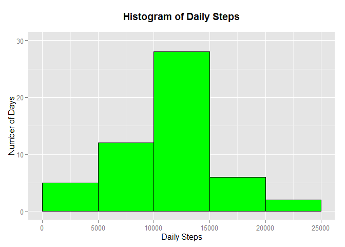

# Reproducible Research: Peer Assessment 1
Daddy the Runner  
`r format(Sys.time(), '%A, %B %d, %Y')`  

<!-- Create some style elements for the HTML file -->
<style>
h2 {
  color: green;
  margin-top: 5ex;
}

p {
  font-size: 12pt;
}

.fig-caption {
  font-size: 10pt;
}
</style>


## Loading and preprocessing the data

First, we load all required libraries.


```r
require(dplyr)
require(ggplot2)
```

The following code chunk will extract the data file from the
zip file if it doesn't exist in the local directory.


```r
data.fn <- "activity.csv"
zip.fn <- "activity.zip"
if (!file.exists(data.fn)) {
  # Extract the data from the zip file
  unzip(zip.fn)
}
```

Once we have the data file extracted, we read it in using the
following code.


```r
data <- read.csv(data.fn, stringsAsFactors = FALSE)
```

Now we are ready to preprocess the data.


```r
## Convert the dates to Date objects
data <- mutate(data, date = as.Date(date))
```


## What is mean total number of steps taken per day?

The following code generates a histogram of the daily steps taken.
First the data is processed to remove all of the missin (NA) values.
Then it is grouped by date and summarized using the `sum()` function.
Finally `ggplot()` is invoked to generate the histogram graphic.


```r
## Create a histogram of the daily steps taken
## group by day and sum the steps
daily.data <- na.omit(data) %>% 
  group_by(date) %>%
  summarize(steps = sum(steps, na.rm = TRUE))

## Create a figure counter
fig.num <- 1L

## Generate the plot
hist.plot <- ggplot(daily.data, aes(x=steps)) +
  geom_histogram(binwidth=5000, color="black", fill="green") +
  scale_y_continuous(limits=c(0,30)) +
  scale_x_continuous(limits=c(0,25000)) +
  xlab("Daily Steps") +
  ylab("Number of Days") +
  ggtitle("Histogram of Daily Steps\n") +
  theme(plot.title = element_text(lineheight=.8, face="bold"))

## Display the plot
hist.plot
```

 

<span class="fig-caption">
**Fig. 1 Histogram of the daily steps.**  The histogram
shows the total number of days where the daily step count falls
within each of the bins across the x axis.
</span>

The mean number of daily steps taken, when steps were recorded, was 
10766.19 and
the median number of daily steps was 10765.


## What is the average daily activity pattern?


## Imputing missing values


## Are there differences in activity patterns between weekdays and weekends?
